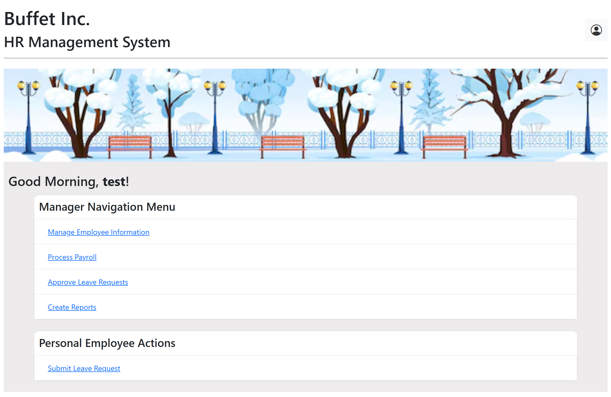
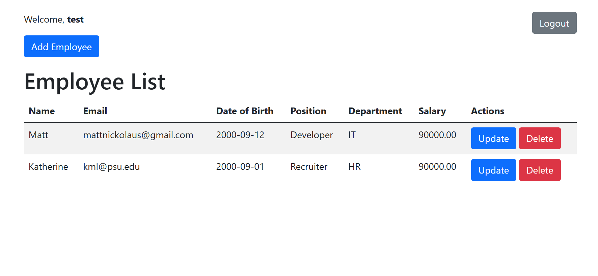

# HR-Management-Group2
HR Management Spring Boot application for IST 412 project. 

## Implementation Completed by:
Matthew Nickolaus: 
- PayrollController
- Payroll period
- PayrollRecord
- PayrollPeriodRepository
- PayrollRecordRepository
- PayrollServiceImpl
- PayrollService
- adjust_payroll_records.html
- payroll_periods.html
- payroll_records.html

## Refactoring by:
Samuel Yudhistira:
- Confirmation when deleting employees
- Added comments to some sections of code
- Created interceptor class for authentication check

## Refactoring by:
Jennifer and Hunter
- Error Handling
- Passwords

